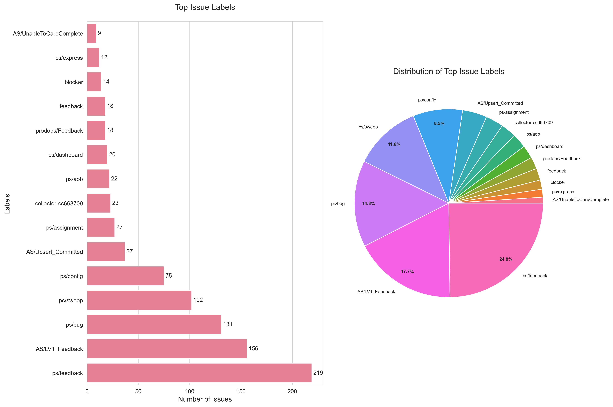

# Jira Reporting



```bash
pip install pandas plotly matlib seaborn numpy
```

## Configure
Rename `config.json.example` -> `config.json`
Edit the file with your credentials.

## Download and output visualizations
```bash
python run_all.py
```
